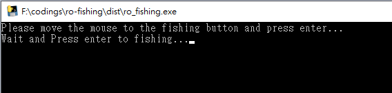

# RO 新世代手遊 釣魚輔助器

* [[釣魚輔助器 - 載點]](https://github.com/WisChang005/ro-fishing-mobile/releases/download/untagged-26fcdf5d733ba8108f0f/ro_fishing.zip)

## 啟動模擬器並且移動至釣魚地點

* 第一次手動紀錄釣魚按鈕位置
```
開啟釣魚輔助器，並將滑鼠移動到指定紅色圈圈位置後按下Enter
```


* 紀錄可拉桿狀態
```
等待釣魚縮圈至可以拉杆時，點擊回到釣魚輔助器視窗並快速按下Enter
此時輔助器會幫你拉起釣竿，並且記錄可拉桿狀態。
(此步驟之後即可自動釣魚)
```



